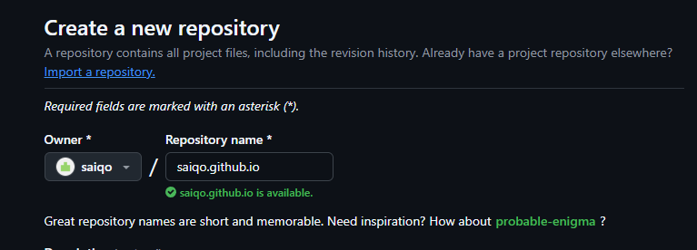
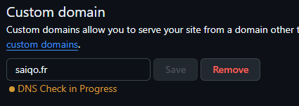
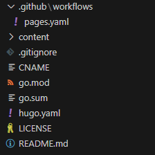
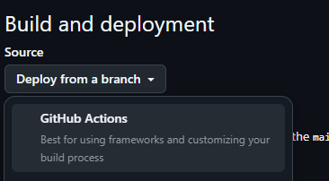

Création d'un site web avec Hugo et déploiement automatique sur Github Pages en utilisant un workflow github

<!--more-->

## Prérequis
-  Hugo, Go et git d'installé

## Configuration du dépot sur Github

### Création
Créer un repo github :


Le nom du repo doit obligatoirement être de la forme : `<pseudo_github>.github.io`


### _Optionnel - Custom DNS_

Si vous possédez votre propre nom de domaine, vous pouvez faire en sorte d'avoir un enregistrement DNS pointant vers cette Github Page

Si vous n'en possédez pas, pas de panique, vous pourrez accéder à votre site avec le lien suivant : `<pseudo_github>.github.io`

Dans les paramètres de notre repo, aller dans le menu Pages 


Puis mettre notre domaine DNS (ou sous-domaine) :


Ajouter les enregistrements suivants dans votre DNS :


En faisant cela, GitHub va nous créer un fichier CNAME contenant notre nom domaine / enregistrement. 
Le fichier est crée à la racine de notre projet

> Doc : https://docs.github.com/fr/pages/configuring-a-custom-domain-for-your-github-pages-site/managing-a-custom-domain-for-your-github-pages-site

## Création du site web 

Pour ce projet, j'ai décidé d'utiliser le thème hextra, trouvé sur https://themes.gohugo.io/

Libre à vous d'utiliser le thème de votre choix, la documentation qui suit sera à adapter en fonction du thème

#### Récupération des fichiers
Nous allons récupérer les fichier du thème hextra et les ajouter à notre projet :
``` bash
# Clone du repo "starter"
git clone https://github.com/imfing/hextra-starter-template.git

# Clone de notre répertoire crée précédemment
git clone https://github.com/saiqo/saiqo.github.io.git

# Copie des fichiers du starter dans le répertoire de notre site
cp -r hextra-starter-template/* saiqo.github.io
n

# Un peu de ménage 
rm -rf hextra-starter-template
cd saiqo.github.io
rm netlify.toml

# Lancement du serveur local
hugo mod tidy
hugo server --logLevel debug --disableFastRender -p 1313
```

On peut se rendre sur notre site avec l'URL : `https://localhost:1313/`

#### Fichier .gitignore

En lançant notre serveur web, hugo à créer plusieurs fichiers et dossiers. 
Afin d'éviter d'envoyer ces fichiers sur notre dépot, nous pouvons créer un fichier .gitignore à la racine de notre projet :

``` git {filename=".gitignore"}
# Hugo output
public/
resources/
.hugo_build.lock

# Editor
.vscode/
```


#### Workflow Github

Nous allons utiliser les workflows github pour build et publier automatiquement notre site sur Github Pages.

Ici encore, il y a plusieurs méthodes pour réaliser cette automatisation. La configuration est à adapter en fonctions de vos besoins.

Pour cet exemple, j'utilise qu'une seule branche `main`, à chaque push sur cette branche, cela va déclencher le workflow de build et de mise à jour du site.

La configuration de notre workflow doit être défini dans : `.github/workflows/pages.yaml`
Contenu du fichier (Fichier provenant de la page Github du projet Hextra) :
``` yaml {filename="pages.yaml"}
# Sample workflow for building and deploying a Hugo site to GitHub Pages
name: Deploy Hugo site to Pages

on:
  # Runs on pushes targeting the default branch
  push:
    branches: ["main"]

  # Allows you to run this workflow manually from the Actions tab
  workflow_dispatch:

# Sets permissions of the GITHUB_TOKEN to allow deployment to GitHub Pages
permissions:
  contents: read
  pages: write
  id-token: write

# Allow only one concurrent deployment, skipping runs queued between the run in-progress and latest queued.
# However, do NOT cancel in-progress runs as we want to allow these production deployments to complete.
concurrency:
  group: "pages"
  cancel-in-progress: false

# Default to bash
defaults:
  run:
    shell: bash

jobs:
  # Build job
  build:
    runs-on: ubuntu-latest
    env:
      HUGO_VERSION: 0.132.2
    steps:
      - name: Checkout
        uses: actions/checkout@v4
        with:
          fetch-depth: 0  # fetch all history for .GitInfo and .Lastmod
          submodules: recursive
      - name: Setup Go
        uses: actions/setup-go@v5
        with:
          go-version: '1.22'
      - name: Setup Pages
        id: pages
        uses: actions/configure-pages@v4
      - name: Setup Hugo
        run: |
          wget -O ${{ runner.temp }}/hugo.deb https://github.com/gohugoio/hugo/releases/download/v${HUGO_VERSION}/hugo_extended_${HUGO_VERSION}_linux-amd64.deb \
          && sudo dpkg -i ${{ runner.temp }}/hugo.deb
      - name: Build with Hugo
        env:
          # For maximum backward compatibility with Hugo modules
          HUGO_ENVIRONMENT: production
          HUGO_ENV: production
        run: |
          hugo \
            --gc --minify \
            --baseURL "${{ steps.pages.outputs.base_url }}/"
      - name: Upload artifact
        uses: actions/upload-pages-artifact@v3
        with:
          path: ./public

  # Deployment job
  deploy:
    environment:
      name: github-pages
      url: ${{ steps.deployment.outputs.page_url }}
    runs-on: ubuntu-latest
    needs: build
    steps:
      - name: Deploy to GitHub Pages
        id: deployment
        uses: actions/deploy-pages@v4
```

L'arborescence du dépôt devrait ressembler à cela :



En revenant sur notre repo github, dans `paramètres -> pages`

Ensuite dans "Build and deployment", modifiez la source et mettez **Github Actions**



>Pour plus de détails, se référer à : https://docs.github.com/en/pages/getting-started-with-github-pages/configuring-a-publishing-source-for-your-github-pages-site#publishing-with-a-custom-github-actions-workflow


## Publication du site

Notre site étant prêt à être déployé, nous allons pousser notre code sur notre repo Github et le site va automatiquement être mis à jour !

Pour publier notre code :
``` bash
# A la racine de notre projet, ajout du fichier à l'index de Git
git add .

# Commit 
git commit -m "Publication du site"

# Push
git push origin main:main
```

Le workflow Github va se lancer automatiquement après avoir commit & push, puis va publier notre site. Cela va durer quelques secondes/minutes, une fois terminé le site est sera accessible.

Et voilà, notre site est prêt et accessible !

>_Pour plus de détails sur la configuration du thème, se référer à la documentation : https://imfing.github.io/hextra/docs/guide/_