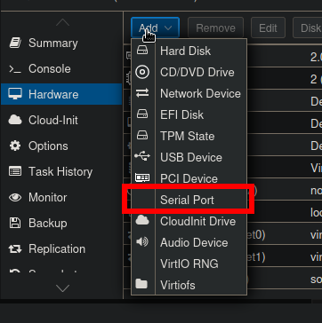

---
date:
  created: 2025-07-21
  updated: 2025-07-21
authors:
  - saiqo
# slug: hello-world
categories:
    - Linux
    - Système
    - Proxmox
tags:
    - Linux
    - Système
    - Proxmox

# links:
#   - docs/index.md
readtime: 4

---

# Ajouter une console Xterm.js à une VM Proxmox
Il peut parfois être nécessaire d'accéder à une VM dans Proxmox sans passer par une connexion SSH. Sauf que la console par défaut n'est pas très pratique, dès lors que l'on souhaite faire des copier/coller ou encore utiliser les touches de fonction.

<!-- more -->

Dans cet article, nous allons voir comment ajouter la console Xterm.js à une machine virtuelle (VM) Proxmox.


## Ajouter un port série à la VM dans Proxmox

Pour utiliser Xterm.js comme console sur une VM Proxmox, il est nécessaire d’ajouter un port série à la machine virtuelle et de configurer le système pour permettre l’accès via ce port.

### 1. Ajouter un port série à la VM

Dans l’interface Proxmox, ouvrez la configuration de votre VM, puis ajoutez un périphérique « Port série » (Serial Port).



### 2. Modifier la configuration de GRUB

!!! Note "Info"
    Si votre VM utilise une image cloud-init, vous n'avez pas besoin de modifier la configuration de GRUB, car le port série est déjà configuré par défaut. Vous pouvez vérifier que la configuration est bien présente dans le fichier `/etc/default/grub` si besoin.

Éditez le fichier `/etc/default/grub` en tant que root :

```bash
$ nano /etc/default/grub
```

Ajoutez ou modifiez la ligne suivante pour inclure le port série :

```bash
GRUB_CMDLINE_LINUX="console=tty0 console=ttyS0,115200"
```

Vous pouvez également ajouter ces paramètres pour une meilleure compatibilité :

```bash
GRUB_TERMINAL="console serial"
GRUB_SERIAL_COMMAND="serial --unit=0 --speed=115200 --word=8 --parity=no --stop=1"
```

### 3. Mettre à jour la configuration de GRUB

Mettez à jour GRUB :

```bash
update-grub
```

Sur certaines distributions tel que des systèmes basés sur Red Hat, utilisez plutôt cette commande  :
```bash
grub2-mkconfig -o /boot/grub2/grub.cfg
```

### 4. Activer le service de console série
Assurez-vous que le service de console série est activé :

```bash
systemctl enable --now serial-getty@ttyS0.service
```

### 5. Redémarrer la VM

Redémarrez la machine virtuelle. Après le démarrage, Xterm.js devrait apparaître comme option de console pour la VM. Vous pouvez maintenant faire des copier/coller et autres actions sans problèmes !
